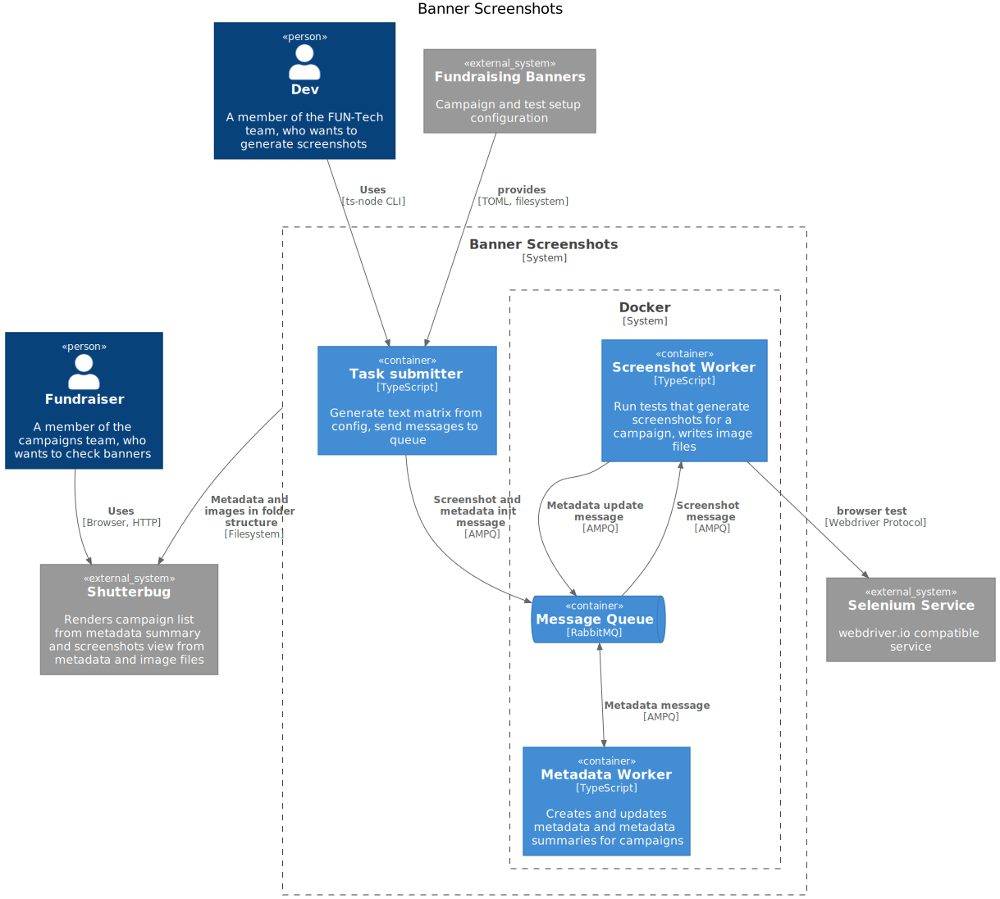

# WMDE Banner Screenshots

This is a tool for taking screenshots of WMDE fundraising banners on wikipedia.org in different browsers and resolutions.

To improve performance, the system consists of parallelizable worker scripts for taking screenshots and processing metadata, connected by a message queue.

## Configuration
The screenshot background worker needs credentials for the Testingbot service. Put these in the file named `.env`.
You can copy and adapt the file `env-template`.

Run the command

	make generate-dev-config

to create the file `docker-compose.dev.yml`. You can have a look inside it
or edit the paths in the file to point at the right files and directories:

- The directory mounted to `/app/banner-shots` will contain the screenshots and metadata.
- The file mounted to `/app/campaign_info.toml` must exist and contain a banner
	configuration file (see below).


## Starting and Stopping the Environment

The screenshot tool needs background workers and a message queue (see architecture diagram below). To start these, run

	make start-workers

This will start the background workers and [RabbitMQ](https://www.rabbitmq.com/) and expose it on Port 5672 on the 
local machine.

You can stop with

	make stop-workers

The Makefile abstracts the ["override"
mechanism](https://docs.docker.com/compose/extends/#multiple-compose-files)
of docker-compose which we use to bind-mount different versions of the
configuration file and output directory in development and production.

## Creating Screenshots

### Downloading the campaign file for a branch

Run the command

	make BRANCH_NAME=<branchname> fetch-campaign-info

Replacing the placeholder `<branchname>` with the branch name you want to
fetch from. It defaults to `main`.

### Running the command

You will run the screenshot tool inside one of the screenshot worker containers with
`docker-compose exec`. With the override configuration and the RabbitMQ
URL being different than the default, this would be a very long command
line. To shorten the call, use the `queue_screenshot.sh` command:

	./queue_screenshot.sh <CAMPAIGN_NAME>

The `queue_screenshot.sh` tool will look for the file `campaign_info.toml`,
create a test matrix and queue the tests. 

`<CAMPAIGN_NAME>` must be one of the configuration keys of that
configuration file, e.g. `desktop` or `mobile`.

The background workers will create a directory inside the `banner-shots`
directory. The campaign directory contains the screenshot images and file
`metadata.json` with all the metadata about the test case.


### Configuration file format

This is the same file used in the [`wmde/fundraising-banners`
repository](https://github.com/wmde/fundraising-banners) for configuring
campaigns. It also contains test matrix configurations.

The TOML file has the following (abbreviated) format

```toml
[campaign]
campaign_tracking = 211215-ba-11
preview_url = "https://example.com/banner/{{PLACEHOLDER}}"
...


[campaign.banners.ctrl]
pagename = "B21_WMDE_Test_11_ctrl"
...


[campaign.test_matrix]

platform = ["edge", "firefox_win10" ]
resolution = ["1280x960", "1024x768"]

```

`[campaign]` is the key you pass to the screenshot tool. The TOML file can
contain several campaigns, each one for a specific *channel* (a
combination of device type and language). `[campaign]` in the example
above is a placeholder, the campaign name can consist of all
alphanumeric characters, e.g. `desktop` or `ipad_en`.

Each campaign will also have at least one banner, configured in the 
`[campaign.banners.BANNER_NAME]` section. Usually, `BANNER_NAME` is `ctrl` or `var`.
Each banner has a unique `pagename` which designates its page name in
CentralNotice. To preview a banner (and to render the screenshot), you
replace the `{{PLACEHOLDER}}` with the banner name in the `preview_url` of
the campaign. The screenshot tool will run the test matrix for each
banner.

The `[campaign.test_matrix]` key can contain one of two test dimensions:
`device` and `orientation` (for mobile devices) or `platform` and
`resolution` (for desktop browsers).

To see the available values for `platform` and `device`, look at the
`CapabilityFactory` class that defines what these values mean in the
context of the testing service (testingbot.com or saucelabs.com).

All values are arrays with at least one element. The screenshot tool will
use each matrix key with each other matrix key and the banners.  
Example:
`platform=["edge", "safari", "chrome_linux"]`, `resolutions=["1280x960",
"1024x768"]` and 2 banners, `ctrl` and `var`, will create 12 (3*2*4)
screenshots.


## Different test functions for different banners

Add a different test function to the `src/test_functions/` directory,
im- and export it in `src/test_functions/index.js` and specify its name in
`testFunctionName` in `index.js`.

## Refreshing the metadata summary

Run the command 

	make force-summary

to trigger the summary command for the metadata worker. This will refresh
the overview page for Shutterbug, based on the existing metadata files. If
a metadata file is invalid, the metadata worker will show a log message
and ignore the file.

## Commands for Troubleshooting

### Check if the containers are running

	docker-compose ps

The container state should be "Up".

### Check if the banner-shots directory is mounted into the container

	docker-compose exec screenshot_worker_1 ash -c 'ls -al'

The directory listing should show the `banner-shots` directory with an
owner of `node`.

### Check if the workers are doing something

You can get a unified stream of log output (with timestamps) by running

	docker-compose logs -tf

By default, the workers should start with the `--verbose` flag
(see `entrypoint` in the `docker-compose` file).


### Show queue and message count

	docker-compose exec rabbitmq bash -c 'rabbitmqctl list_queues'


## Local development

See [DEVELOPMENT](DEVELOPMENT.md)

## Architecture


